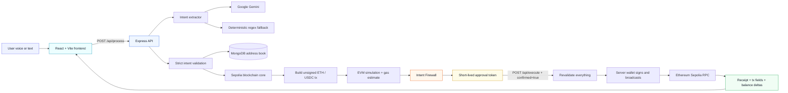
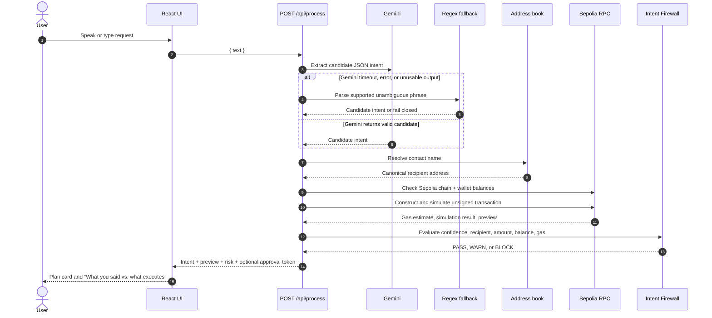
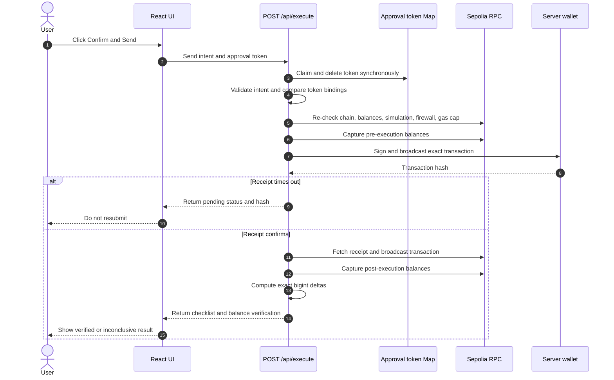
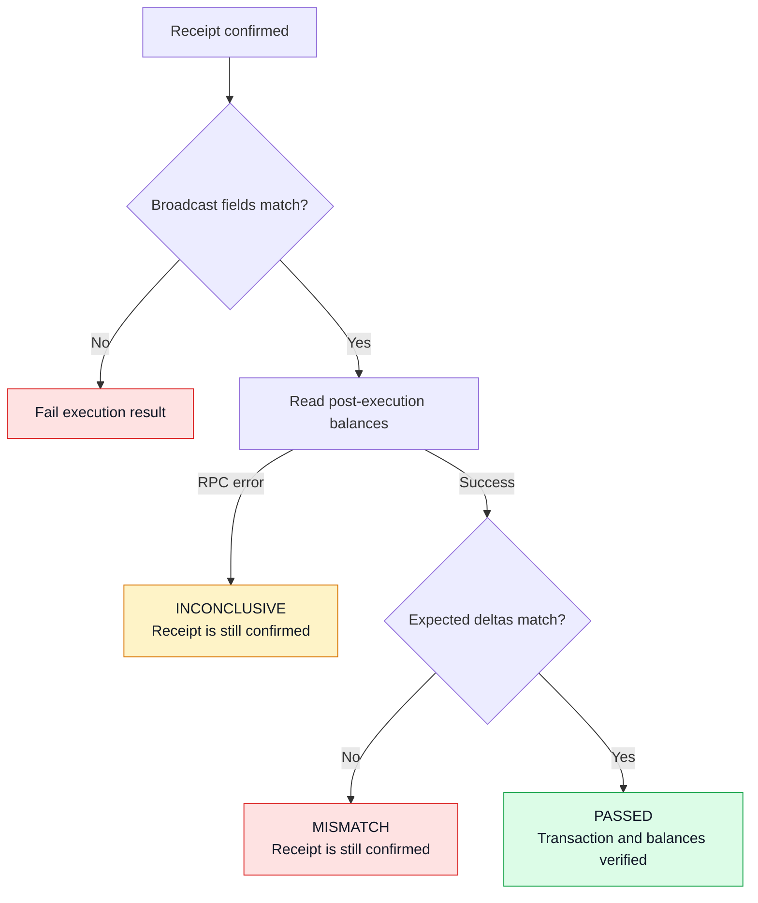
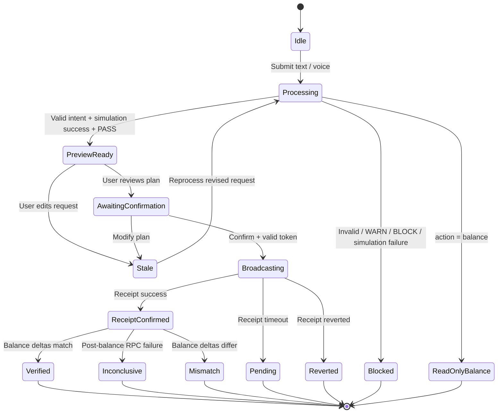
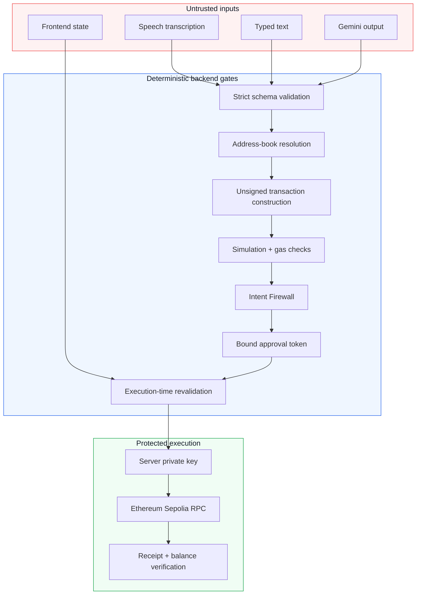

# VoxIntent

> **A voice-first, zero-trust interface for safe Ethereum Sepolia transactions.**
>
> Speak an intent. Review the plan. Approve once. Verify what actually happened on-chain.

<div align="center">


</div>

---

## Contents

- [What is VoxIntent?](#what-is-voxintent)
- [Why the architecture is different](#why-the-architecture-is-different)
- [System architecture](#system-architecture)
- [End-to-end workflow](#end-to-end-workflow)
- [API reference](#api-reference)
- [Execution state machine](#execution-state-machine)
- [Security model](#security-model)
- [Project structure](#project-structure)
- [Local setup](#local-setup)
- [Testing](#testing)
- [Production hardening](#production-hardening)
- [Technical notes](#technical-notes)

---

## What is VoxIntent?

VoxIntent turns natural-language requests such as:

```text
Send 0.05 ETH to Rahul
Send 25 USDC to Alice
Check my balance
```

into a controlled transaction workflow for **Ethereum Sepolia**.

The LLM is used only at the **interpretation boundary**. It never signs, constructs, or broadcasts a transaction. Every executable request must pass through deterministic schema validation, address-book resolution, transaction simulation, firewall checks, explicit confirmation, approval-token validation, and post-execution verification.

### Supported actions

| Spoken intent | Backend action | Can broadcast? |
|---|---|---:|
| Check wallet balance | `balance` | No — read-only |
| Send native Ether | `send_eth` | Yes, after all gates pass |
| Send Circle USDC | `send_usdc` | Yes, after all gates pass |

### Core principles

- **LLM is untrusted.** It proposes structured data; deterministic code decides what is valid.
- **Address-book only.** Users name contacts; arbitrary wallet addresses are not accepted by the fallback parser.
- **Preview before approval.** The UI shows confirmed facts separately from estimated runtime values.
- **One-time authorization.** Approval tokens are short-lived, parameter-bound, and deleted before execution awaits.
- **Fail closed.** Unknown recipients, bad simulation, insufficient funds, changed parameters, stale previews, WARN, and BLOCK states cannot execute.
- **Verify reality.** A successful receipt is not the end: balance deltas and a typed checklist explain what was confirmed.

---

## Why the architecture is different

Most voice-to-transaction demos connect speech directly to a wallet action. VoxIntent deliberately inserts a **deterministic safety corridor** between language and execution:

```text
Natural language  →  Structured intent  →  Validated preview  →  Explicit approval  →  Verified result
       LLM                 Zod/schema             Firewall              Single-use token          On-chain checks
```

The design keeps the convenient conversational interface while ensuring the final transaction is derived from validated backend state—not from raw model output or frontend state.

---

## System architecture



### Component responsibilities

| Component | Responsibility | Trust level |
|---|---|---|
| React frontend | Voice/text input, plan card, comparison panel, confirmation UI, verification display | Untrusted presentation layer |
| Express API | Input validation, orchestration, rate limiting, CORS, security headers | Trusted control plane |
| Gemini extractor | Converts natural language into a candidate intent | Untrusted interpreter |
| Regex fallback | Deterministic recovery for unambiguous supported phrases | Constrained parser |
| Intent validator | Strict action, amount, confidence, and recipient validation | Deterministic gate |
| MongoDB address book | Maps contact names to wallet addresses | Source of recipient truth |
| Intent Firewall | Balance, simulation, gas, recipient, amount, and policy decisions | Deterministic policy engine |
| Approval-token store | Single-use, short-lived authorization binding | In-memory prototype store |
| viem blockchain core | Sepolia chain checks, transaction construction, signing, receipt verification | Execution boundary |

### Repository graph at a glance

The repository graph contains the following major communities and hubs:

- **Blockchain Backend Core:** `constructUnsignedTransaction()`, `simulateAndPreviewTransaction()`, `executeAndVerifyTransaction()`, `publicClient`, `walletClient`, `evaluateRisk()`
- **Frontend React App:** `App()`, typed API response models, plan card, comparison UI, checklist UI
- **Database & Startup:** `connectDB()`, `getContactsCollection()`, `validateIntent()`, `startServer()`
- **Backend Dependencies and Scripts:** Express, viem, MongoDB, Gemini, TypeScript, test tooling
- **No import cycles detected** in the generated repository graph.

### Visual system architecture


---

## End-to-end workflow

### 1. Process and preview workflow



### 2. Execute and verify workflow



### 3. What is actually verified?



---

## API reference

Base URL during local development: `http://localhost:3000`

### `GET /health`

Lightweight backend health check.

```bash
curl http://localhost:3000/health
```

```json
{
  "status": "ok",
  "message": "Backend is running"
}
```

---

### `POST /api/process`

Extracts, validates, resolves, simulates, evaluates, and previews an intent.

#### Request

The body must contain exactly one field: `text`. Maximum length: **500 characters**.

```bash
curl -X POST http://localhost:3000/api/process \
  -H 'Content-Type: application/json' \
  -d '{"text":"Send 25 USDC to Alice"}'
```

#### Successful transfer response shape

```json
{
  "intent": {
    "action": "send_usdc",
    "amount": "25",
    "recipient": "Alice",
    "confidence": 0.97
  },
  "resolvedAddress": "0x...",
  "preview": {
    "network": "sepolia",
    "asset": "USDC",
    "contractAddress": "0x1c7D4B196Cb0C7B01d743Fbc6116a902379C7238",
    "sender": "0x...",
    "recipient": "0x...",
    "amount": "25",
    "amountRaw": "25000000",
    "amountEth": "0",
    "estimatedGas": "65000",
    "gasCostEth": "0.00013",
    "totalCostEth": "0.00013",
    "simulationStatus": "success"
  },
  "risk": {
    "verdict": "PASS",
    "reasons": []
  },
  "approvalToken": "uuid-v4-token"
}
```

#### Balance request

```bash
curl -X POST http://localhost:3000/api/process \
  -H 'Content-Type: application/json' \
  -d '{"text":"Check my balance"}'
```

A balance request returns `intent`, `balance`, and `risk`, but **never** returns a transaction preview or approval token.

#### Important error cases

| Status | Example reason |
|---:|---|
| `400` | Invalid body, empty text, unsupported intent, malformed amount, unknown contact |
| `403` | Firewall `WARN` or `BLOCK` during execution-related validation |
| `429` | Rate limit exceeded |
| `500` | RPC or backend failure |

---

### `POST /api/execute`

Revalidates and executes a previously previewed transaction.

#### Request

```json
{
  "intent": {
    "action": "send_eth",
    "amount": "0.05",
    "recipient": "Rahul",
    "confidence": 0.97
  },
  "confirmed": true,
  "approvalToken": "uuid-v4-token"
}
```

The backend requires:

- `confirmed === true`.
- A valid UUID v4 approval token.
- A token that has not expired or been used.
- Exact match for sender, recipient, asset, amount, contract, network, gas limit, and maximum cost.
- A fresh successful simulation and a second firewall PASS.

#### Confirmed response

```json
{
  "success": true,
  "pending": false,
  "hash": "0x...",
  "message": "Transaction successfully executed, confirmed, and verified on-chain.",
  "checklist": [
    { "id": "receipt", "status": "passed" },
    { "id": "recipient", "status": "passed" },
    { "id": "intent", "status": "passed" },
    { "id": "balance", "status": "passed" },
    { "id": "hash", "status": "passed" }
  ],
  "balanceVerification": {
    "status": "passed",
    "asset": "ETH",
    "preSenderEth": "10000000000000000000",
    "postSenderEth": "9949958000000000000",
    "senderEthDelta": "50042000000000000",
    "actualGasFeeWei": "42000000000000",
    "expectedTransferUnits": "50000000000000000"
  }
}
```

#### Pending response

A broadcast can succeed even when receipt confirmation times out. In this case the backend returns HTTP `200` with `pending: true`:

```json
{
  "success": false,
  "pending": true,
  "hash": "0x...",
  "message": "Transaction broadcast; receipt and balance verification pending.",
  "checklist": [
    { "id": "hash", "status": "passed" },
    { "id": "receipt", "status": "pending" },
    { "id": "recipient", "status": "pending" },
    { "id": "intent", "status": "pending" },
    { "id": "balance", "status": "pending" }
  ],
  "balanceVerification": {
    "status": "pending",
    "asset": "ETH"
  }
}
```

> **Never resubmit a pending transaction.** Use the transaction hash to monitor Sepolia confirmation.

---

## Execution state machine



---

## Security model

### Trust boundaries



### Security invariants

1. **Sepolia-only:** chain ID must be `11155111` during startup, simulation, and execution.
2. **Official USDC only:** configured contract must match Circle’s Ethereum Sepolia USDC contract:
   `0x1c7D4B196Cb0C7B01d743Fbc6116a902379C7238`.
3. **No arbitrary recipients:** contacts resolve through MongoDB address-book records.
4. **No client-controlled transaction payload:** the backend reconstructs the unsigned transaction from validated intent.
5. **No approval on unsafe preview:** only successful simulation plus firewall `PASS` produces a token.
6. **Token binding:** token fields include sender, recipient, asset, amount, raw amount, contract, network, gas estimate, and cost cap.
7. **Single use:** token is deleted before async execution work begins.
8. **Fresh execution checks:** the backend revalidates intent, chain, balance, simulation, gas, and firewall state immediately before broadcast.
9. **No false success:** `pending`, `inconclusive`, and `mismatch` states are represented separately from verified success.
10. **Local-only binding:** the prototype binds to `127.0.0.1`, not `0.0.0.0`.

> **Prototype limitation:** approval tokens currently live in an in-memory `Map`. A horizontally scaled deployment must use a shared atomic store such as Redis with TTL and `GETDEL`/Lua semantics.

---

## Project structure

```text
Vox-Intent/
├── backend/
│   ├── src/
│   │   ├── index.ts                    # Express app and API routes
│   │   ├── extractor.ts                # Gemini + fallback extraction
│   │   ├── fallback.ts                 # Deterministic regex parser
│   │   ├── intent.ts                   # Strict intent validation + contact resolution
│   │   ├── firewall.ts                  # Deterministic risk engine
│   │   ├── blockchain.ts               # Sepolia tx, simulation, execution, verification
│   │   ├── db.ts                       # MongoDB address book
│   │   ├── intent-comparison.ts        # Shared comparison/checklist types
│   │   ├── test-setup.ts               # Isolated test configuration
│   │   ├── phase-b.test.ts             # Phase B regression tests
│   │   └── phase-c.test.ts             # Balance verification tests
│   └── package.json
├── frontend/
│   ├── src/
│   │   ├── App.tsx                    # Main product workflow and UI
│   │   ├── App.css                    # Component styling
│   │   ├── index.css                  # Global styling and theme
│   │   └── intent-comparison.ts       # Frontend comparison/checklist types
│   └── package.json
├── .env.example
└── README.md
```

---

## Local setup

### Prerequisites

- Node.js **20+**
- npm
- Google Gemini API key
- Sepolia RPC URL
- A dedicated wallet private key funded only with testnet ETH and, if needed, Sepolia USDC

### 1. Install dependencies

```bash
git clone https://github.com/tusharvaskarsharma/Vox-Intent.git
cd Vox-Intent

cd backend
npm install

cd ../frontend
npm install
```

### 2. Configure environment

Create a root `.env` file from the example:

```bash
cd ..
cp .env.example .env
```

```env
PORT=3000
FRONTEND_URL=http://localhost:5173

GEMINI_API_KEY=your_gemini_api_key_here

SEPOLIA_RPC_URL=https://rpc2.sepolia.org
SEPOLIA_PRIVATE_KEY=0x_your_testnet_private_key_here
SEPOLIA_USDC_CONTRACT_ADDRESS=0x1c7D4B196Cb0C7B01d743Fbc6116a902379C7238

ADDRESS_BOOK={"Rahul":"0x...","Alice":"0x..."}
```

**Never commit `.env` or a real private key.** Use a dedicated Sepolia-only wallet.

### 3. Run the backend

```bash
cd backend
npm run dev
```

Backend: `http://localhost:3000`

### 4. Run the frontend

In a second terminal:

```bash
cd frontend
npm run dev
```

Frontend: `http://localhost:5173`

### 5. Verify the backend

```bash
curl http://localhost:3000/health
```

---

## Testing

The backend suite is self-contained and does not require a funded wallet or live user secrets.

```bash
cd backend
npm test
```

The suite covers:

- LLM extraction and malformed-output handling.
- Deterministic regex fallback parsing.
- Strict intent and amount validation.
- Address-book recipient resolution.
- ETH and USDC transaction construction.
- Sepolia chain and Circle USDC contract enforcement.
- Simulation and gas failure handling.
- Firewall PASS/WARN/BLOCK decisions.
- Approval-token replay and concurrency protection.
- Stale request and revised-intent handling.
- Plan-card and mismatch data.
- Read-only balance behavior.
- Pre-execution balance fail-closed behavior.
- Post-execution ETH/USDC balance deltas.
- Pending, reverted, mismatch, and inconclusive outcomes.
- Five-item verification checklist consistency.

Current verified baseline: **164 tests passed**.

### Production builds

```bash
# Backend
cd backend
npm run build

# Frontend
cd ../frontend
npm run build
```

---

## Production hardening

This repository is a security-focused **Sepolia prototype**, not a production custody system. Before public or multi-user deployment:

- Replace the in-memory approval-token `Map` with a distributed atomic store and TTL.
- Add authentication and session-bound approval tokens.
- Use HTTPS/TLS and a hardened reverse proxy.
- Move signing to a dedicated wallet service, HSM, or custody provider.
- Never expose a private key through frontend code or browser storage.
- Add structured audit logs without logging secrets or private transaction data unnecessarily.
- Add nonce management, replacement-transaction policy, and RPC failover.
- Validate receipt gas metadata strictly; missing fee fields should produce an inconclusive verification state rather than assuming zero.
- Reject or explicitly model same-address USDC transfers.
- Run live Sepolia tests only with a dedicated, low-value test wallet.
- Add monitoring for failed simulations, rejected approvals, RPC errors, and pending receipts.

---

## Technical notes

### Exact amount handling

Amounts are accepted as validated decimal strings and converted to integer base units:

- ETH: wei via `parseEther()`.
- USDC: 6-decimal micro-units via `parseUnits(amount, 6)`.
- Balance deltas and gas costs are compared with `bigint`, avoiding floating-point rounding.

### Verification statuses

| Status | Meaning |
|---|---|
| `passed` | The expected condition was confirmed. |
| `failed` | The condition was checked and did not match. |
| `pending` | The transaction has been broadcast, but receipt confirmation is not complete. |
| `inconclusive` | The receipt may be confirmed, but a required verification read failed. |

### Network scope

- Chain: **Ethereum Sepolia**
- Chain ID: **11155111**
- USDC: Circle Ethereum Sepolia contract
- Explorer: [Sepolia Etherscan](https://sepolia.etherscan.io/)

---

## Final mental model

```text
The model can suggest.
The address book can resolve.
The simulator can estimate.
The firewall can approve.
Only the validated backend can execute.
The chain can confirm.
The balance delta can prove what happened.
```

---

<div align="center">

**VoxIntent — conversational UX with deterministic transaction safety.**

</div>
